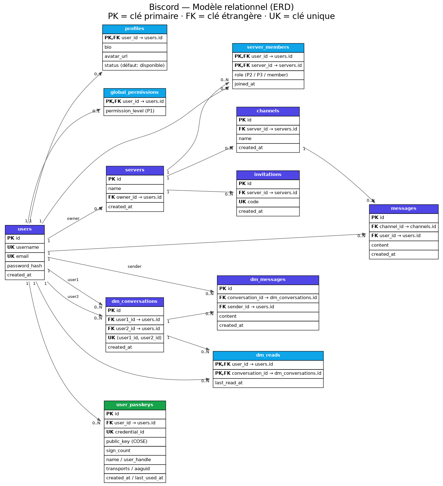

# Modèle de données Biscord

Ce dossier documente le schéma relationnel de Biscord (MySQL 8 / InnoDB,
`utf8mb4`). Le schéma de référence est versionné dans deux fichiers SQL :

| Fichier | Contenu |
| --- | --- |
| [`biscord_db.sql`](../../biscord_db.sql) | Schéma métier principal (12 tables, contraintes, index) |
| [`laravel/database/sql/user_passkeys.sql`](../../laravel/database/sql/user_passkeys.sql) | Table `user_passkeys` (PoC WebAuthn) appliquée séparément |

Livrables de ce dossier :

- [`biscord-erd.mmd`](biscord-erd.mmd) — diagramme entité-association au format **Mermaid** (rendu ci-dessous, lisible sur GitHub) ;
- [`biscord-erd.dot`](biscord-erd.dot) — même diagramme au format **Graphviz** (source du PNG) ;
- [`biscord-erd.png`](biscord-erd.png) — export **PNG** prêt à imprimer pour le dossier de soutenance.

Pour régénérer le PNG : `dot -Tpng docs/database/biscord-erd.dot -o docs/database/biscord-erd.png`.

## Diagramme relationnel (Mermaid)

```mermaid
erDiagram
    users ||--o| profiles : "possède"
    users ||--o| global_permissions : "peut détenir"
    users ||--o{ servers : "possède (owner)"
    users ||--o{ server_members : "adhère"
    servers ||--o{ server_members : "regroupe"
    servers ||--o{ channels : "contient"
    servers ||--o{ invitations : "émet"
    channels ||--o{ messages : "héberge"
    users ||--o{ messages : "écrit"
    users ||--o{ dm_conversations : "participe (user1)"
    users ||--o{ dm_conversations : "participe (user2)"
    dm_conversations ||--o{ dm_messages : "contient"
    users ||--o{ dm_messages : "envoie"
    users ||--o{ dm_reads : "suit la lecture"
    dm_conversations ||--o{ dm_reads : "est suivie par"
    users ||--o{ user_passkeys : "enregistre"

    users {
        int id PK
        varchar username UK
        varchar email UK
        text password_hash
        timestamp created_at
    }
    profiles {
        int user_id PK_FK
        text bio
        varchar avatar_url
        varchar status
    }
    global_permissions {
        int user_id PK_FK
        enum permission_level
    }
    servers {
        int id PK
        varchar name
        int owner_id FK
        datetime created_at
    }
    server_members {
        int user_id PK_FK
        int server_id PK_FK
        datetime joined_at
        enum role
    }
    channels {
        int id PK
        int server_id FK
        varchar name
        datetime created_at
    }
    messages {
        int id PK
        int channel_id FK
        int user_id FK
        text content
        datetime created_at
    }
    invitations {
        int id PK
        int server_id FK
        varchar code UK
        timestamp created_at
    }
    dm_conversations {
        int id PK
        int user1_id FK
        int user2_id FK
        datetime created_at
    }
    dm_messages {
        int id PK
        int conversation_id FK
        int sender_id FK
        text content
        datetime created_at
    }
    dm_reads {
        int user_id PK_FK
        int conversation_id PK_FK
        datetime last_read_at
    }
    user_passkeys {
        int id PK
        int user_id FK
        varchar credential_id UK
        text public_key
        bigint sign_count
        varchar name
        varchar user_handle
        varchar transports
        varchar aaguid
        timestamp created_at
        timestamp last_used_at
    }
```

Version image : 

## Entités et relations

### Vue d'ensemble des cardinalités

| Relation | Cardinalité | Clé étrangère | Suppression |
| --- | --- | --- | --- |
| `users` → `profiles` | 1 — 0..1 | `profiles.user_id` | `ON DELETE CASCADE` |
| `users` → `global_permissions` | 1 — 0..1 | `global_permissions.user_id` | `ON DELETE CASCADE` |
| `users` → `servers` (propriétaire) | 1 — 0..N | `servers.owner_id` | `ON DELETE CASCADE` |
| `users` ↔ `servers` (appartenance) | N — M via `server_members` | `server_members.user_id`, `server_members.server_id` | `ON DELETE CASCADE` |
| `servers` → `channels` | 1 — 0..N | `channels.server_id` | `ON DELETE CASCADE` |
| `servers` → `invitations` | 1 — 0..N | `invitations.server_id` | `ON DELETE CASCADE` |
| `channels` → `messages` | 1 — 0..N | `messages.channel_id` | `ON DELETE CASCADE` |
| `users` → `messages` (auteur) | 1 — 0..N | `messages.user_id` | `ON DELETE CASCADE` |
| `users` → `dm_conversations` (user1 / user2) | 1 — 0..N (deux FK) | `dm_conversations.user1_id`, `user2_id` | `ON DELETE CASCADE` |
| `dm_conversations` → `dm_messages` | 1 — 0..N | `dm_messages.conversation_id` | `ON DELETE CASCADE` |
| `users` → `dm_messages` (expéditeur) | 1 — 0..N | `dm_messages.sender_id` | `ON DELETE CASCADE` |
| `users` ↔ `dm_conversations` via `dm_reads` | N — M | `dm_reads.user_id`, `dm_reads.conversation_id` | `ON DELETE CASCADE` |
| `users` → `user_passkeys` | 1 — 0..N | `user_passkeys.user_id` | `ON DELETE CASCADE` |

### Détail des tables

#### `users`
Compte applicatif. **PK** `id`. Contraintes d'unicité **UK** sur `username` et `email`.
Le mot de passe est stocké haché (`password_hash`, bcrypt) — jamais en clair.

#### `profiles`
Profil public (relation 1—1 facultative). **PK** = **FK** `user_id → users.id`.
`status` vaut `disponible` par défaut.

#### `global_permissions`
Droits **globaux** (transverses à toute l'application). **PK** = **FK** `user_id → users.id`.
`permission_level` est l'`enum('P1')` : la présence d'une ligne `P1` désigne un **super administrateur**.

#### `servers`
Serveur (communauté). **PK** `id`. **FK** `owner_id → users.id` : le créateur/propriétaire.

#### `server_members`
Table d'association **N—M** entre `users` et `servers`. **PK composite** (`user_id`, `server_id`).
`role` est l'`enum('P2','P3','member')` : rôle **au sein du serveur**
(`P2` = administrateur de serveur, `P3` = modérateur, `member` = membre standard).

#### `channels`
Salon textuel d'un serveur. **PK** `id`. **FK** `server_id → servers.id`.

#### `messages`
Message public posté dans un salon. **PK** `id`.
**FK** `channel_id → channels.id`, `user_id → users.id`.
Index composite `(channel_id, created_at, id)` pour l'historique trié.

#### `invitations`
Code d'invitation à un serveur. **PK** `id`. **FK** `server_id → servers.id`.
**UK** `code` (le code public partagé).

#### `dm_conversations`
Conversation privée entre **deux** utilisateurs. **PK** `id`.
**FK** `user1_id → users.id` et `user2_id → users.id`.
**UK** `(user1_id, user2_id)` : une seule conversation par paire (paire ordonnée à l'insertion).

#### `dm_messages`
Message privé. **PK** `id`. **FK** `conversation_id → dm_conversations.id`, `sender_id → users.id`.
Index composite `(conversation_id, created_at, id)`.

#### `dm_reads`
Suivi de lecture des DM (« vu le … »). **PK composite** (`user_id`, `conversation_id`),
toutes deux **FK**. Sert au calcul des notifications de messages non lus.

#### `user_passkeys`
Identifiants WebAuthn / passkeys (PoC). **PK** `id`. **FK** `user_id → users.id`.
**UK** `credential_id`. Ne stocke **que** des données publiques (clé publique COSE,
compteur anti-rejeu `sign_count`) ; la clé privée ne quitte jamais l'authentificateur.

## Modèle d'autorisation

Biscord distingue deux niveaux de droits, ce qui explique la séparation en deux tables :

- **Global** (`global_permissions.permission_level`)
  - `P1` — super administrateur de la plateforme.
- **Par serveur** (`server_members.role`)
  - `P2` — administrateur du serveur ;
  - `P3` — modérateur du serveur ;
  - `member` — membre standard (valeur par défaut).

## Remarque sur `private_messages` (table héritée)

L'instance de production peut encore contenir une table `private_messages`
(ancienne implémentation des messages privés). Elle est **dépréciée** et
**absente du schéma de référence** (`biscord_db.sql`) : les conversations
privées passent désormais par `dm_conversations` / `dm_messages` / `dm_reads`.
Elle n'apparaît donc pas dans l'ERD.
